# Eikonal Wave Propagation & Ray Tracing

A Python implementation of the **Eikonal equation solver** using the Fast Marching Method, with applications to wave propagation simulation, ray tracing, and maze solving.

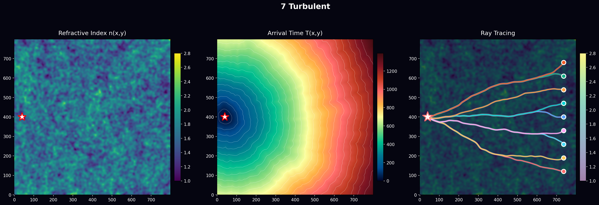

## Overview

This project solves the classical Eikonal equation:

$$|\nabla T| = n(x,y)$$

where $T(x,y)$ is the arrival time field and $n(x,y)$ is the refractive index. The solution is computed using the **Fast Marching Method (FMM)**, a numerically efficient $O(N \log N)$ algorithm.

## Features

- **Fast Marching Method** solver with Numba JIT optimization
- **Ray tracing** via gradient descent on the arrival time field
- **Multiple media types**: homogeneous, gradient, lenses, turbulent, discontinuous interfaces
- **Snell's law verification** with convergence analysis
- **Maze generation and solving**

---

## Project Structure

```
propage/
├── src/
│   ├── solver.py      # Eikonal solver (FMM)
│   ├── raytracer.py   # Ray tracing by gradient descent
│   ├── media.py       # Refractive index field generators
│   └── visualize.py   # Plotting utilities
├── main.py            # Media experiments
├── maze_experiments.py
├── snell_convergence.py
└── results/           # Output images
```

---

## 1. Wave Propagation in Various Media

We simulate wave propagation through 8 different media configurations:

| Medium | Description |
|--------|-------------|
| Homogeneous | Uniform $n = 1.5$ |
| Vertical Gradient | $n$ varies from 1.0 to 2.5 vertically |
| Planar Diopter | Sharp interface $n_1 = 1.0 \to n_2 = 1.7$ |
| Double Diopter | Glass slab (air-glass-air) |
| Circular Lens | Spherical lens with $n = 2.2$ |
| Multi-Lens | Three circular lenses |
| Turbulent | Random multi-scale fluctuations |
| Complex Structure | Combined diopter + lens + layer |

### Results

<table>
<tr>
<td></td>
<td>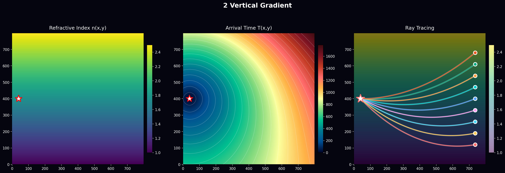</td>
</tr>
<tr>
<td>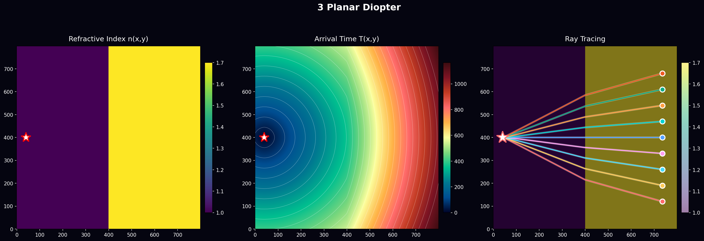</td>
<td>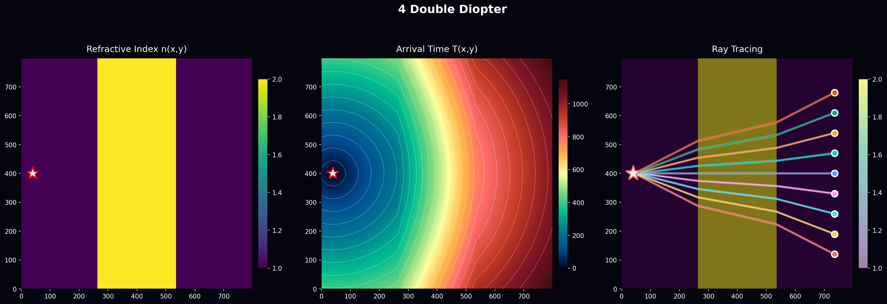</td>
</tr>
<tr>
<td>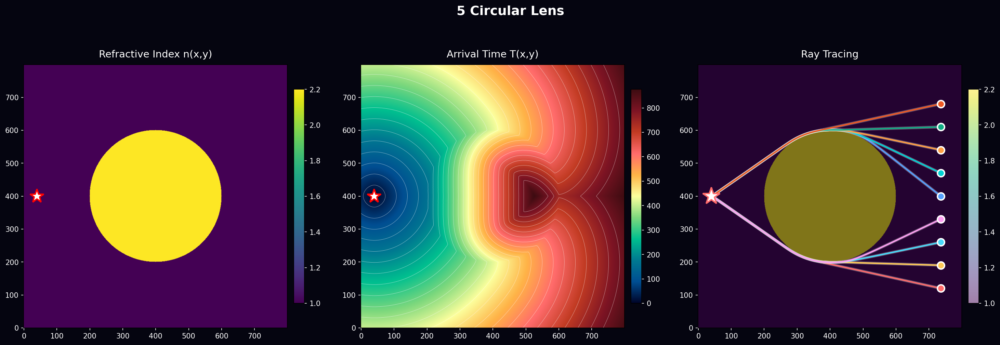</td>
<td>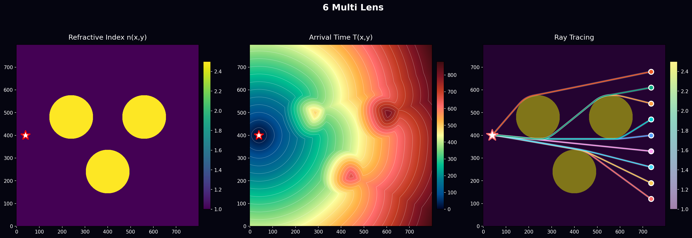</td>
</tr>
</table>

---

## 2. Snell-Descartes Law Derivation

### From Eikonal to Snell's Law

At a planar interface between two media with refractive indices $n_1$ and $n_2$, Snell's law emerges from the Eikonal equation.

**Setup**: Consider a vertical interface at $x = x_0$. The arrival time $T$ must be continuous across the interface:

$$T(x_0^-, y) = T(x_0^+, y)$$

**Argument**:

1. For a ray making angle $\theta$ with the normal, the gradient components are:
   $$\frac{\partial T}{\partial y} = n \sin\theta, \quad \frac{\partial T}{\partial x} = n \cos\theta$$


2. Applying continuity of $\partial T / \partial y$ at the interface:

$$\frac{\partial T}{\partial y}\bigg|_1 = \frac{\partial T}{\partial y}\bigg|_2$$

   $$\boxed{n_1 \sin\theta_1 = n_2 \sin\theta_2}$$


### Numerical Verification

We verify Snell's law by tracing 40 rays through a planar diopter at multiple resolutions:

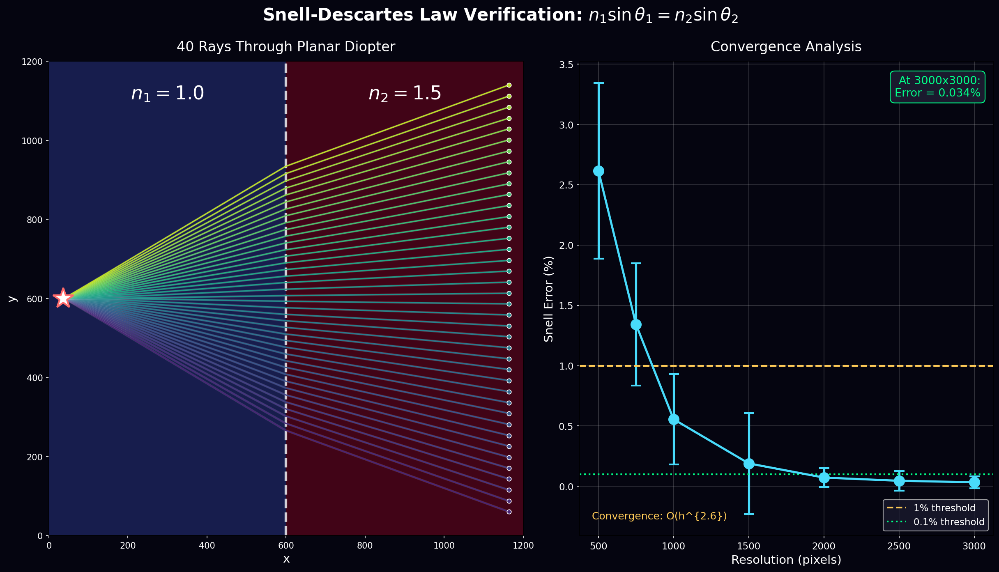

### Convergence Results

| Resolution | Mean Error | Std Dev |
|------------|-----------|---------|
| 500×500 | 2.62% | ±0.73% |
| 750×750 | 1.34% | ±0.51% |
| 1000×1000 | 0.56% | ±0.37% |
| 1500×1500 | 0.19% | ±0.42% |
| 2000×2000 | 0.073% | ±0.08% |
| 2500×2500 | 0.046% | ±0.08% |
| **3000×3000** | **0.034%** | ±0.05% |

**Convergence order**: $O(h^{2.57})$ — better than quadratic!

At 3000×3000 resolution with 40 rays spanning ±45°, the Snell ratio $\frac{n_1 \sin\theta_1}{n_2 \sin\theta_2}$ is within **0.034%** of unity.

---

## 3. Maze Solving

The Eikonal equation naturally finds shortest paths in a maze when walls have high refractive index ($n = 10000$) and corridors have $n = 1$.

### Algorithm

1. Generate a perfect maze using recursive backtracking
2. Place source at maze exit, target at maze entrance
3. Solve Eikonal equation — wave propagates only through corridors
4. Trace ray from target to source following $-\nabla T$

### Results

<table>
<tr>
<td>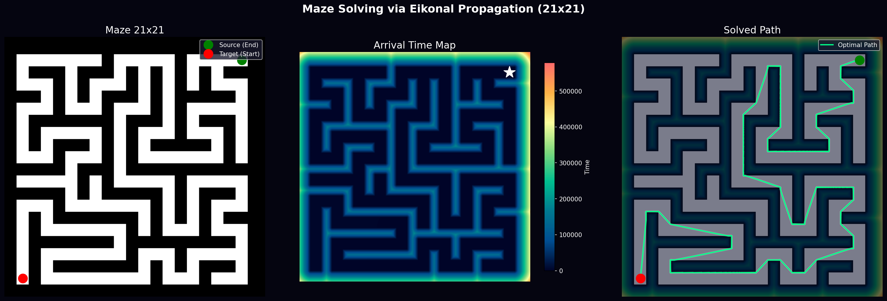</td>
<td>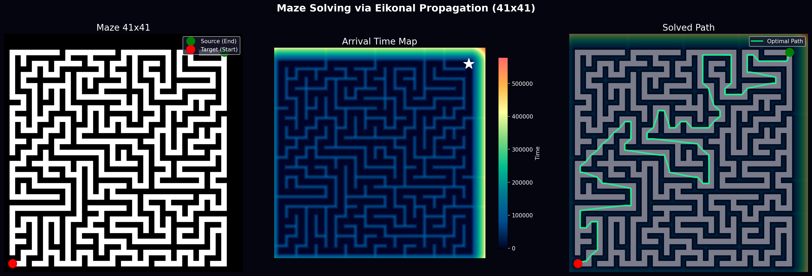</td>
</tr>
<tr>
<td>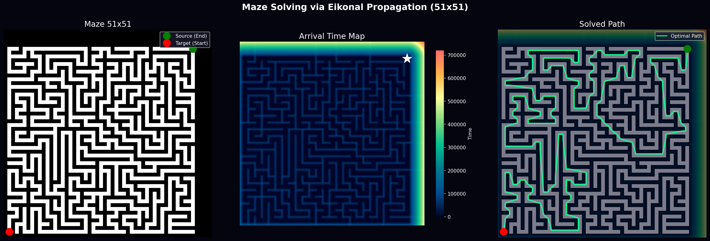</td>
<td>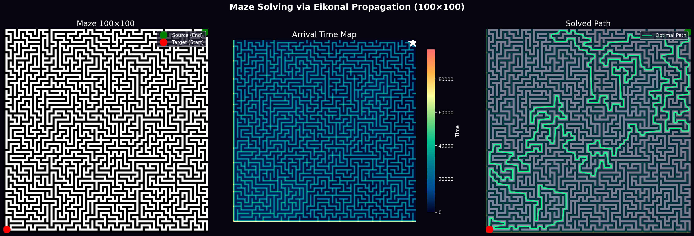</td>
</tr>
</table>

| Maze Size | Solve Time | Path Length |
|-----------|-----------|-------------|
| 11×11 | 2.0s | 2,939 pts |
| 21×21 | 3.4s | 9,113 pts |
| 31×31 | 5.0s | 12,135 pts |
| 41×41 | 6.3s | 8,461 pts |
| 51×51 | 7.5s | 16,296 pts |

---

## Installation

```bash
git clone https://github.com/YOUR_USERNAME/propage.git
cd propage
pip install numpy matplotlib numba scipy
```

## Usage

```bash
# Run media experiments
python main.py

# Run maze experiments
python maze_experiments.py

# Run Snell's law convergence study
python snell_convergence.py
```

## Requirements

- Python 3.8+
- NumPy
- Matplotlib
- Numba
- SciPy

## Mathematical Background

The **Eikonal equation** describes the propagation of wavefronts in a medium with spatially varying wave speed $v(x,y) = c/n(x,y)$:

$$|\nabla T(x,y)| = \frac{1}{v(x,y)} = \frac{n(x,y)}{c}$$

Setting $c = 1$, we get the dimensionless form: $|\nabla T| = n$.

The **Fast Marching Method** solves this equation by:
1. Maintaining a narrow band of "trial" points around frozen (computed) points
2. Selecting the trial point with minimum $T$ value
3. Updating neighboring points using the upwind finite difference scheme
4. Repeating until all points are frozen

**Ray tracing** follows the characteristic curves of the Eikonal equation, which are perpendicular to wavefronts:

$$\frac{d\mathbf{r}}{ds} = -\frac{\nabla T}{|\nabla T|}$$

---

## License

MIT License

## Author

Generated with Eikonal wave propagation simulation.
